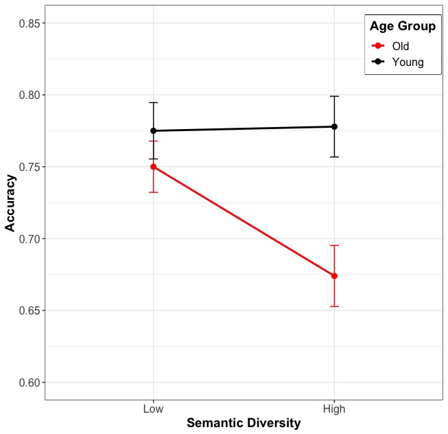
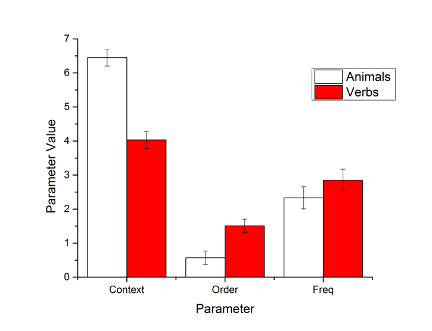

# Projects

## Grammatical Error Correction
**Supervisor:** Jungyeul Park, Ph.D.

**Collaborators:** Xuejiao Chen, Maggie Liu, Krishna Parvathala, Apurva Patil

## The Effects of Semantic Diversity on Paired-Associate Learning
**Supervisor:** Brendan Johns, Ph.D.

## Memory Searching Pathway Underlying Verb Fluency
**Supervisor:** Brendan Johns, Ph.D.

- Verbal fluency is one of the most widely used measures of cognitive functioning, in which subjects produce as many different words as possible from a given criterion (e.g., animal category) within 1 minute.

- Compared to noun category fluency, there are fewer studies on verb fluency, even though verbs are thought to play a more prominent role in organizing mental lexicon and in describing events.

- The current study compares memory search pathway underlying verb fluency to noun (animal category) fluency using a cognitive modeling approach.

- The modeling results show that animal fluency and verb fluency have distinct memory search pathways. People dynamically use semantic (context) and syntactic (order) information to organize memory retrieval in verb fluency. 

- Verb fluency may be useful in diagnosing different clinical populations (e.g., agrammatic vs. anomic aphasia) as they may exhibit different search patterns.

**Qiu, M.** & Johns, B. T. (2018). [Memory searching pathway underlying verb fluency](../pub/Qiu_Johns_ASHA_2018.pdf). Poster presented at the *2018 ASHA Convention*.
